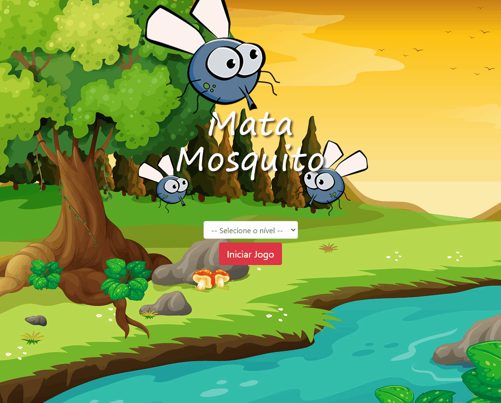

# App-Game-Mata-Mosquito

<h1 align="center">
 
  App Mata Mosquito
 
</h1>

 App using only HTML and JAVASCRIPT.

  

## 🚀 Technologies

- [HTML] Para estrutura em tela e semântica das tags.
- [CSS] Para estilizar e alinhar os itens em tela.
- [JAVASCRIPT] Para desenvolver a lógica do game utilizando operadores condicionais
e aprendendo a acessar e manipular eventos da (DOM).